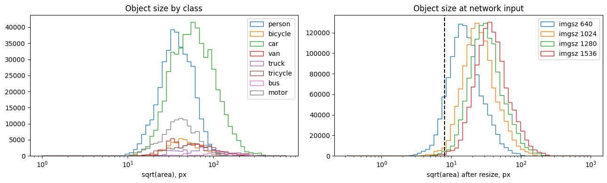
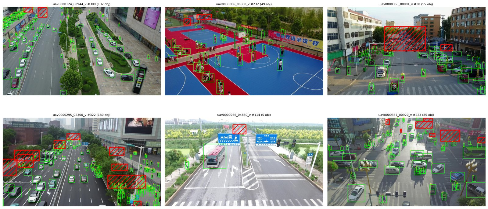
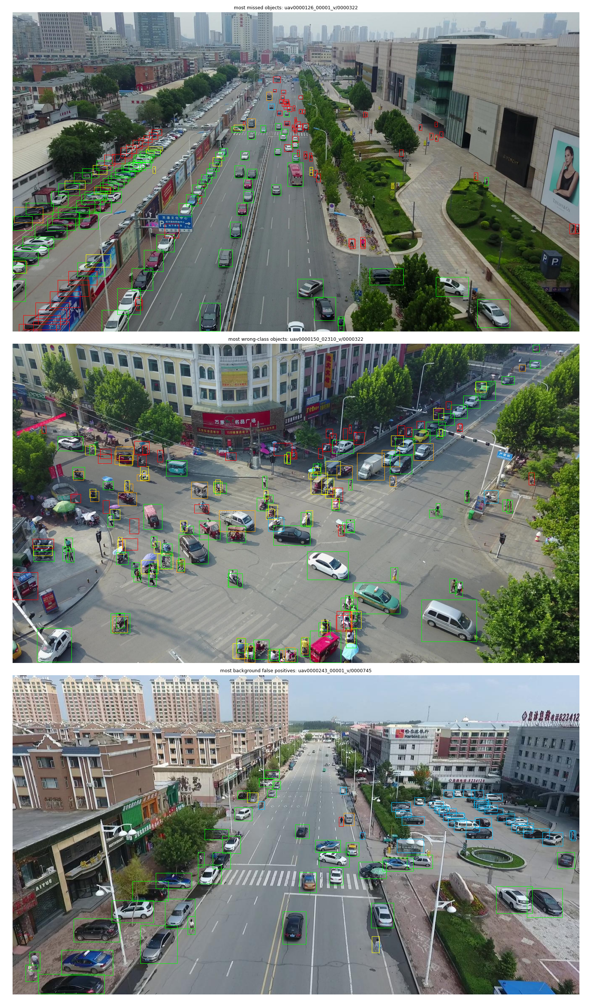

## Introduction

We detect 8 object classes (person, bicycle, car, van, truck, tricycle, bus, motor) in drone video frames from VisDrone2019-VID and submit boxes for 48 unlabelled test clips. The labelled data has **56 train clips (24,201 frames)** and **7 val clips (2,846 frames)** with 1.2 million objects.

The data analysis showed four main difficulties:

- **Small objects:** 24% of objects are smaller than 32×32 px (COCO "small"), so the input resolution decides how many objects are visible at all.
- **Dense scenes:** 42 objects per frame at the median and up to 180, so duplicate suppression and the detection limit matter.
- **Class imbalance:** car and person are three quarters of the objects, bus is under 1%, while mAP weighs every class equally.
- **Correlated frames and a shift to test:** neighbouring frames are near-duplicates, clips come from shared source flights, and the test set has darker and lower-resolution clips.

We compare four detector families under one protocol and out-of-fold validation, next to a YOLO11s baseline, and then build the final pipeline from data, inference and ensemble strategies on top of the best models. Code: [`src/core`](src/core/), one notebook per step in [`notebooks/`](notebooks/).

## Method

### Data preparation

Code: [01_eda_preprocessing.ipynb](notebooks/01_eda_preprocessing.ipynb).

| | train | val | test |
|---|---|---|---|
| clips / frames | 56 / 24,201 | 7 / 2,846 | 48 / 3,811 |
| objects (per frame) | 1,105,516 (45.7) | 114,132 (40.1) | — |
| frame widths, px | 1344–2720 | 1344–3840 | 680–1920 |

The annotations are clean: no zero-size or out-of-frame boxes, no duplicates, no gaps in frame numbering. Each finding sets one design choice:

| Finding | Decision |
|---|---|
| 24% of objects are small; at 640 px, 9.7% shrink below 8 px (the finest stride), at 1280 px only 0.6%. | Train and predict at **1280 px**. |
| k-means box shapes at 1280 px: 9×16 to 124×99 px, h/w 0.5–1.9. | Test anchors **16–256 px** instead of 32–512. |
| Median 42 objects per frame, up to 180. | Up to **500 detections** per image, **300 queries** for RT-DETR. |
| Same-track IoU between frames t and t+k: 0.90 (k=1), 0.59 (k=5), 0.35 (k=10). | Train on **every 5th frame**: 5× less compute, frames still differ. |
| 20 ignored regions and "others" per frame, in 72% of frames. | Mask them in training, skip them in evaluation. |
| 8 test clips are 680–960 px wide; test is darker (mean brightness 100 vs 116). | Measure the loss at 960 px in the final pipeline. |

Ultralytics reads the YOLO txt labels and torchvision the COCO json; on 60 val frames both agree exactly. Ignored regions and "others" are `iscrowd=1` in evaluation, so detections inside them do not count. In training they are filled with the frame's mean colour and objects at least 50% inside them are dropped, so crowds are not taught as background. Only the baseline trains without this masking.

### Validation strategy

The official val split has 7 clips, and bus appears in only one of them, so a single holdout is a noisy benchmark. Several clips are also segments of one source flight. We pool train and val (63 clips, 55 flights, 27,047 frames) and split them into **4 folds with `GroupKFold` by flight** ([`assign_folds`](src/core/data.py)), so no flight is split across folds.

Each fold model predicts every frame of its held-out fold, and models are compared by the **out-of-fold (OOF) mAP** over all labelled frames. We keep the last epoch, since picking the best one on the held-out fold would inflate OOF. k-means anchors are fitted on the training folds only. Metrics are COCO mAP, AP50, AP_small and per-class AP ([`coco_evaluate`](src/core/evaluate.py)) with up to 500 detections per image, plus batch-1 time per image on a T4.

For the test set, the 4 fold models each predict and their boxes are merged with Weighted Boxes Fusion ([`fold_ensemble`](src/core/fusion.py)). This gain cannot be scored OOF, so it is measured on the public leaderboard.

### Model selection and tuning

All detectors share one protocol ([`PROTOCOL`](src/core/__init__.py)): COCO-pretrained weights, long side 1280 px, every 5th training frame, horizontal flip, ignored-region masking, 8 epochs, batch 4, seed 42. Each family changes only its own parameters, one at a time, on fold 0; the best experiment gets the full 4-fold CV (its fold-0 score is slightly optimistic). Data and inference changes are kept for the final pipeline, so that their effect is measured separately from the model.

| Family | Model | Experiments (one change each) | Notebook |
|---|---|---|---|
| Baseline | YOLO11s, Ultralytics defaults | — | [02](notebooks/02_baseline.ipynb) |
| Two-stage anchor-based | Faster R-CNN v2, ResNet-50 FPN | RoI positive fraction 0.5; anchors 16–256; box loss ×2; step LR | [03](notebooks/03_faster_rcnn.ipynb) |
| One-stage anchor-based | RetinaNet v2 | anchors 16–256; + IoU 0.4/0.3; focal γ=0 | [04](notebooks/04_retinanet.ipynb) |
| Anchor-free | FCOS | centre radius 0.5 / 2.5; box loss ×2 | [05](notebooks/05_fcos.ipynb) |
| Query-based | RT-DETR-L, 1.5 GPU-h per fold | lr 3·10⁻⁴; no denoising queries | [06](notebooks/06_rtdetr.ipynb) |

## Results

### Baseline

YOLO11s, Ultralytics defaults (SGD, lr 0.01, mosaic), 20 epochs, 1280 px, every 5th frame, no ignore masking ([02_baseline.ipynb](notebooks/02_baseline.ipynb), [cv_baseline.json](reports/baseline/cv_baseline.json)).

OOF over all 27,047 frames: **mAP 0.188**, AP50 0.356, AP_small 0.053; fold mean 0.200 ± 0.038; 35.6 ms per image on a T4. Fold mAP ranges from 0.156 to 0.247 with the held-out flights, so a single split could not separate most variants. Small objects are the main weakness (AP_small 0.053 vs AP_large 0.334). Public LB: 0.173 for a single fold model, **0.213** for the WBF ensemble of the 4 fold models. Per-fold and per-class results, training curves: [02_baseline.ipynb](notebooks/02_baseline.ipynb).

### Two-stage anchor-based: Faster R-CNN

SGD (momentum 0.9), lr 0.005, linear warmup and cosine decay, AMP ([03_faster_rcnn.ipynb](notebooks/03_faster_rcnn.ipynb), [reports/faster_rcnn](reports/faster_rcnn/)).

All four experiments stay within 0.010 mAP of the default (0.225 on fold 0); the step LR schedule is the best (0.235) and gets the full CV. OOF: **mAP 0.212**, AP50 0.416, AP_small 0.055; fold mean 0.224 ± 0.027; 66.3 ms per image. That is 0.024 above the baseline, mostly from AP50 and large objects, at 1.9× its inference time; bus, truck and van gain the most.

**What each stage contributes.** The RPN sets the ceiling on recall: with 1,000 proposals it covers only 39% of objects under 16 px and 74% of 16–32 px ones. The RoI head classifies and filters the class-agnostic proposals, keeping 92% of the covered objects, but does not tighten the boxes of tiny objects. 300 proposals are enough (+0.003 mAP from 300 to 2,000).

**Failure cases.** Misses are mostly tiny distant objects and densely parked cars that get no proposal; class errors are between tricycles, motors and bicycles, which look alike from above; background false positives are parked cars that are probably unlabelled.

Public LB of the 4-fold WBF ensemble: **0.243** (baseline 0.213). Sweep table, per-class AP, stage and proposal tables: [03_faster_rcnn.ipynb](notebooks/03_faster_rcnn.ipynb).

### One-stage anchor-based: RetinaNet

lr 0.0025 ([04_retinanet.ipynb](notebooks/04_retinanet.ipynb), [reports/retinanet](reports/retinanet/)). With the default 32–512 anchors, no anchor matches any object under 16 px and 42% of 16–32 px objects; anchors 16–256 (from the EDA box sizes) cut this to 47% and 1.4%, but double the negatives per positive anchor (286 → 580).

On fold 0 smaller anchors raise AP_small from 0.025 to 0.042 but lose 0.07 AP_large, so mAP falls (0.215 → 0.199); lower IoU thresholds make it worse. Removing the focal term (γ = 0) is slightly better than the default (0.221) and gets the full CV. OOF: **mAP 0.188**, AP50 0.357, AP_small 0.041; fold mean 0.200 ± 0.031; 48.5 ms per image. That equals the baseline and is 0.024 below the tuned Faster R-CNN (0.235 vs 0.221 on fold 0).

**Without a proposal stage**, localisation is weaker (AP75 0.176 vs 0.190) and small objects suffer most (AP_small 0.041 vs 0.055), as expected. The focal loss turned out unnecessary: the prior bias of the classifier already handles the imbalance. Fixing anchors alone does not close the gap; learned assignment or an anchor-free head (FCOS) is the cleaner fix. Public LB: **0.188**. Anchor, sweep and per-class tables: [04_retinanet.ipynb](notebooks/04_retinanet.ipynb).

### Anchor-free: FCOS

lr 0.0025 ([05_fcos.ipynb](notebooks/05_fcos.ipynb)). Without anchors, a feature-map location is positive for an object if it lies inside the box and within `radius × stride` of its centre, on the FPN level that matches the box size; a location inside several boxes takes the smallest. The radius sets how many positives an object gets: at radius 1.5 a 16–32 px object gets a median of 6, at 2.5 it gets 9 and a large object 25. Objects under 16 px are the exception: 4.7% of them get no positive at any radius, since a box smaller than the stride may contain no location at all. In dense scenes a wider radius makes the sampling regions of neighbours overlap.

Search range: radius 0.5, 1.5 (default), 2.5, and box loss ×2. No change beats the default (0.205 on fold 0): radius 0.5 gives too few positives (AP75 −0.025), radius 2.5 loses 0.021 AP_medium to ambiguous positives in crowds, and box loss ×2 has no effect. So the initial and tuned FCOS are the same model. OOF: **mAP 0.179**, AP50 0.355, AP_small 0.050; fold mean 0.191 ± 0.029; 49 ms per image. Public LB of the 4-fold WBF ensemble: **0.162**.

Against the tuned anchor-based detectors, by object size (OOF): FCOS beats RetinaNet on small objects (AP_small 0.050 vs 0.041), as the assignment suggests, but loses on medium (0.158 vs 0.164) and large ones (0.341 vs 0.376), and is the weakest overall. Faster R-CNN leads in every size bin (0.055 / 0.193 / 0.401). Assignment and sweep tables: [05_fcos.ipynb](notebooks/05_fcos.ipynb).

### Query-based: RT-DETR

AdamW, cosine schedule, 300 queries. The compute budget is the baseline's: 1.5 GPU-hours per fold, and Ultralytics fits the epochs into this time. Held-out mAP over training hours is plotted against the YOLO baseline with the same budget.

_In progress._

### Comparison of all models

OOF over all labelled frames for the selected experiment of each family; fold-0 mAP for the initial (default) configuration.

| Model | Initial, fold-0 mAP | Selected experiment | OOF mAP | AP50 | AP_small | ms / image | Public LB |
|---|---:|---|---:|---:|---:|---:|---:|
| YOLO11s baseline | 0.195 | — | 0.188 | 0.356 | 0.053 | 35.6 | 0.213 |
| Faster R-CNN | 0.225 | step LR | 0.212 | 0.416 | 0.055 | 66.3 | 0.243 |
| RetinaNet | 0.215 | focal γ = 0 | 0.187 | 0.357 | 0.041 | 48.5 | 0.188 |
| FCOS | 0.205 | default (radius 1.5) | 0.179 | 0.355 | 0.050 | 49.2 | 0.162 |
| RT-DETR-L | | | | | | | |

### Final pipeline

Three steps on fold 0, so that the effect of data and inference is separated from the effect of the model:

1. **Data and model** ([07_0_yolo.ipynb](notebooks/07_0_yolo.ipynb)): YOLO11s on masked data (the data effect alone), then a P2 high-resolution head and a higher classification loss weight.
2. **Inference** ([07_1_inference.ipynb](notebooks/07_1_inference.ipynb)): for the best run of each family, horizontal flip and 2×2 overlapping tiles merged by NMS or WBF, also at 960 px to mimic the low-resolution test clips.
3. **Ensemble** ([07_2_ensemble.ipynb](notebooks/07_2_ensemble.ipynb)): cross-model WBF of the top models, and temporal rescoring: a box confirmed in neighbouring frames keeps its score, a box seen once loses part of it ([`rescore`](src/core/temporal.py)).

_Results pending._

| Submission | Internal mAP | Public LB |
|---|---:|---:|
| YOLO11s baseline, single fold model | | 0.173 |
| YOLO11s baseline, fold ensemble (WBF of 4 fold models) | 0.188 (OOF) | 0.213 |
| Faster R-CNN step LR, fold ensemble | 0.212 (OOF) | 0.243 |
| RetinaNet γ = 0, fold ensemble | 0.187 (OOF) | 0.188 |
| FCOS default, fold ensemble | 0.179 (OOF) | 0.162 |
| Inference + temporal rescoring (07.1) | | 0.314 |
| Cross-model ensemble (07.2) | | 0.322 |

## Final model and reproducibility

### Final model

_Pending: the selected ensemble, its fold-0 / OOF score and public LB score._

### Reproducibility

Every notebook runs on Kaggle (GPU T4, Internet on) with the competition data attached. Its first cells clone this repository and install Ultralytics and faster-coco-eval; the package versions of our runs are in [requirements.txt](requirements.txt), and the seed is 42 everywhere.

1. Run the notebooks in order: 01 → 02 → 03, 04 → 05, 06, 07_0 → 07_1 → 07_2 (→ 08 for the visualizations).
2. Attach the outputs of the earlier notebooks as Kaggle inputs; a rerun with its own previous output attached resumes from the saved folds.
3. 07_2 writes the final `submission.csv`.

Every run saves `cv_<name>.json` with its config, seed, package versions and GPU.

## Conclusion

AI-usage: we used AI (Claude Opus 5.5) for generating code that is not connected to the final result itself (tables, plots e.g), to format some of our thoughts in the report, to correct grammar and punctuation both in notebooks and report.
## References

- Data: Zhu et al., *Detection and Tracking Meet Drones Challenge* (VisDrone), arXiv:2001.06303.
- Models: Ren et al., Faster R-CNN, arXiv:1506.01497; Lin et al., RetinaNet / focal loss, arXiv:1708.02002; Tian et al., FCOS, arXiv:1904.01355; Zhao et al., RT-DETR, arXiv:2304.08069; Ultralytics YOLO11 and RT-DETR (docs.ultralytics.com); torchvision detection models.
- Evaluation: COCO detection metrics (cocodataset.org/#detection-eval); faster-coco-eval (github.com/MiXaiLL76/faster_coco_eval).
- Ensembling: Solovyev et al., Weighted Boxes Fusion, arXiv:1910.13302.
- Visualization: Selvaraju et al., Grad-CAM, arXiv:1610.02391; Zhu et al., Deformable DETR, arXiv:2010.04159; van der Maaten & Hinton, t-SNE (JMLR 2008).
